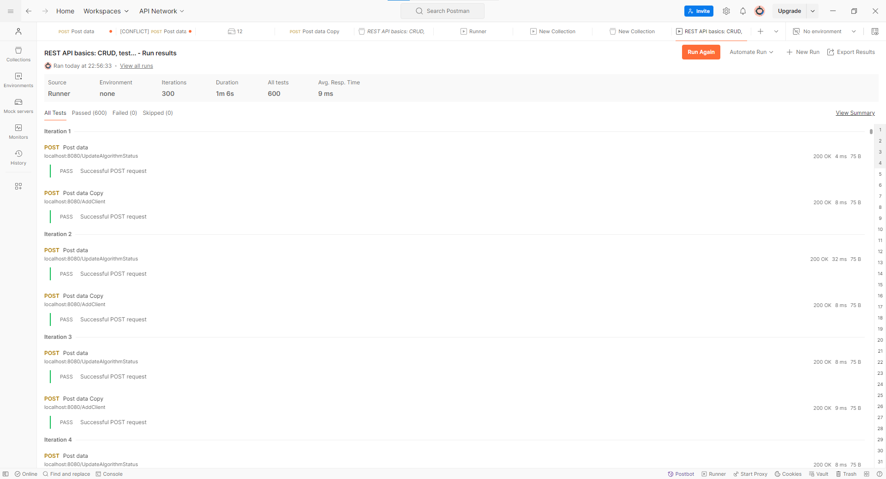

## Описание задания
<ol>
<li><b>Общие сведения</b><br>
   <b>Название проекта:</b> Сервис синхронизации пользовательских алгоритмов<br>
   <b>Описание проекта:</b> Микросервис на golang для синхронизации работы алгоритмов<br>
   <b>Цель проекта:</b> Создать сервис, который синхронизирует работу алгоритмов с их статусами в базе данных<br> </li>

<li><b>Требования к функциональности</b><br>
   Должен быть какой-то обработчик которые раз в 5 мин смотрит статусы алгоритмов и если алгоритм включен, то нужно создать соответствующий pod, если алгоритм выключен, то нужно удалить соответствующий pod<br>
   Должно быть 4 api ручка:<br>
   AddClient()<br>
   UpdateClient()<br>
   DeleteClient()<br>
   UpdateAlgorithmStatus()</li>
<li><b>Технические требования</b></li>
   <ul><li>Язык программирования: Go 1.22</li>
       <li>Библиотеки и фреймворки: Любые на ваш выбор</li>
       <li>Архитектура: REST API</li>
       <li>База данных:  Postgres</li></ul>
<li><b>Нефункциональные требования</b</li>
   <ul><li>Производительность: Время отклика сервера не более 200мс</li>
    <li>Rps: до 100 на запись, до 100 на чтение</li></ul>
<li><b>Тестирование</b></li>
   Тестирование: Unit-тесты для всех основных функций
<li> <b>Требования к</b></li>
      Документация кода:
   Комментарии к основным модулям и функциям<br>
        Пользовательская документация: Руководство пользователя
<li> <b>Сроки выполнения</b><br>
  <ul> Ожидаемые сроки: 3 дня</ul></li>

<li> <b>Детали реализации:</b><br>

type Client struct {
ID                   	int64
ClientName   	string  
Version          	int     
Image            	string  
CPU               	string  
Memory         	string  
Priority          	float64
NeedRestart 	bool    
SpawnedAt   	time.Time
CreatedAt     	time.Time
UpdatedAt    	time.Time
}

type Deployer interface {
CreatePod(name string) error
DeletePod(name string) error
GetPodList() ([]string, error)
}

table AlgorithmStatus

id               int64
client_id     int64
VWAP      bool
TWAP      bool
HFT         bool

По дефолту все алгоритмы выключены<br></li>

<li> <b>Отправка на проверку</b><br>

После написания сервиса, нужно загрузить его в гитхаб в публичный репо и скинуть ссылку на почту: andrew@vortex.foundation<br></li>
</ol>

### Руководство пользователя

Для запуска микросервиса необходимо воспользоваться командой ``git clone https://github.com/kksama1/vortex_test_task.git``<br>
После того, как проект будет с клонирован, в консоли необходимо перейти в корневую папку проекта и написать команду ``docker-compose up``<br>
После этого в docker будут развёрнуты два контейнера. Один с приложением на go и второй с базой данных postgres.
База данных состоит из двух таблиц: "clients" и "algorithm_status". Ниже приведён sql-запрос для их создания:<br>
```sql
    CREATE TABLE IF NOT EXISTS clients (
    ID SERIAL PRIMARY KEY,
    ClientName VARCHAR(255),
    Version INT,
    Image VARCHAR(255),
    CPU VARCHAR(50),
    Memory VARCHAR(50),
    Priority FLOAT,
    NeedRestart BOOLEAN,
    SpawnedAt TIMESTAMP DEFAULT CURRENT_TIMESTAMP,
    CreatedAt TIMESTAMP DEFAULT CURRENT_TIMESTAMP,
    UpdatedAt TIMESTAMP DEFAULT CURRENT_TIMESTAMP
);
```

```sql
    CREATE TABLE IF NOT EXISTS algorithm_status (
    ID SERIAL PRIMARY KEY,
    ClientID INTEGER UNIQUE references clients(ID)  ON DELETE CASCADE,
    VWAP BOOLEAN DEFAULT FALSE,
    TWAP BOOLEAN DEFAULT FALSE,
    HFT BOOLEAN DEFAULT FALSE
);
```
Для взаимодействия пользователя с сервисом предусмотрены 4 api "ручки":
<ol><li><b>AddClient</b></li>
К этой "ручке" можно обратиться по адресу: http://localhost:8080/AddClient. Она отправляет POST-запрос сервису на добавление нового клиента. Для того чтобы отправить данные на добавление, необходимо поместить в тело запроса json следующего формата:

```json
{
    "clientName": "Cena",
    "version": 2,
    "image": "image2",
    "cpu": "cpu2",
    "memory":"200mib",
    "priority": 10.2,
    "needRestart": true
}
```

После чего сервис считает данные пользователя и добавит запись о нём базу данных клиентов и создаст запись в таблице алгоритмов принадлежащую пользователю.

<li><b>UpdateClient</b></li>
К этой "ручке" можно обратиться по адресу: http://localhost:8080/UpdateClient. Она отправляет POST-запрос сервису на изменение записи об определённом клиeнте. Для того чтобы отправить данные на добавление, необходимо поместить в тело запроса json следующего формата:<br>

```json
{
    "id": 2,
    "clientName": "Cena",
    "version": 2,
    "image": "image2",
    "cpu": "cpu2",
    "memory":"200mib",
    "priority": 10.2,
    "needRestart": true
}
```

<li><b>DeleteClient</b></li>
К этой "ручке" можно обратиться по адресу: http://localhost:8080/DeleteClient. Она отправляет POST-запрос сервису на удаление заданного пользователя из базы данных клиентов и удалит его запись в таблице алгоритмов. Для того чтобы отправить данные на добавление, необходимо поместить в тело запроса json следующего формата:

```json
{
    "id": 2
}
```
<li><b>UpdateAlgorithmStatus</b></li>
К этой "ручке" можно обратиться по адресу: http://localhost:8080/UpdateAlgorithmStatus. Она отправляет POST-запрос сервису на изменение статуса алгоритма принадлежащего определенному пользователю. Пользователь может поменять значение полей VWAP, TWAP, HFT. Для того чтобы отправить данные на добавление, необходимо поместить в тело запроса json следующего формата:

```json
{
"clientID":2,
"vwap": true,
"twap": false,
"hft": true
}
```
</ol>
Так же сервис каждые 5 минут проверяет статусы алгоритмов и если алгоритм включен, то создаёт pod с названием соответствующим уникальному идентификатору пользователя, если алгоритм выключен, то удаляет соответствующий pod.
Каждые пять минут можно увидеть список активных и не активных подов в виде логов в докер-контейнере приложения. Так же там легируется сообщеия, что пользователь был добавлен, была изменена или удалена его запись, изменения состояния алгоритмов и сообщения о создании или удалении подов.

### На рисунке ниже показан результат нагрузочного тестирования (300 итераций, задержка 1ms)
